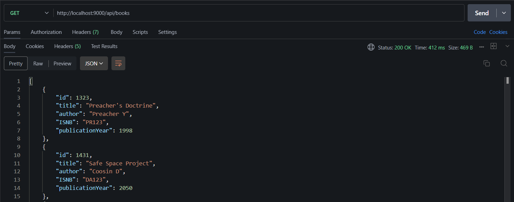
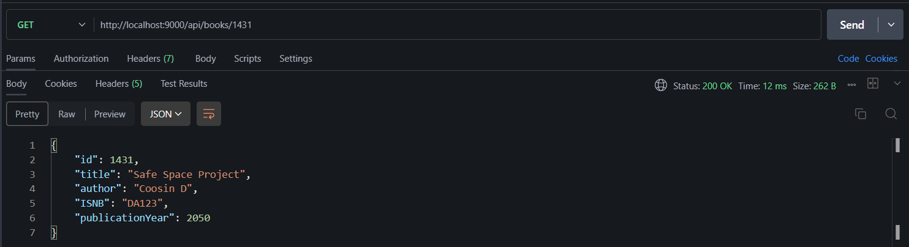
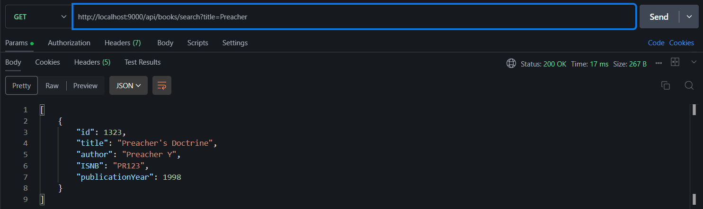
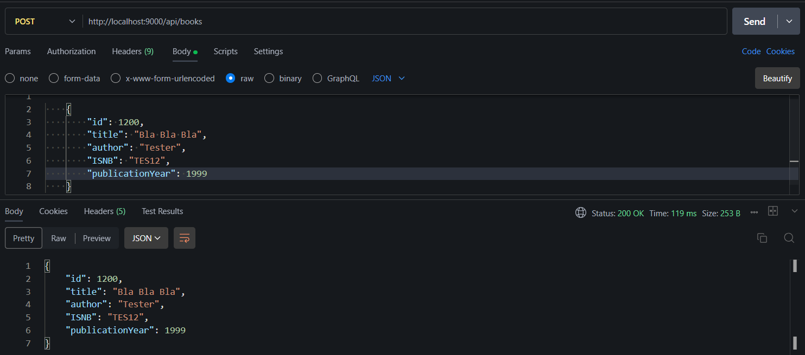
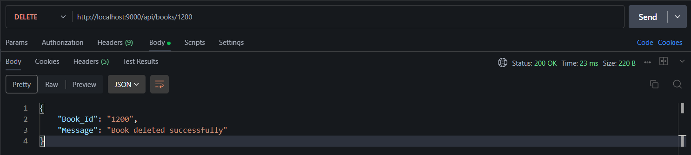

# Question 1 Library Book Management API

Create a RESTful API for a simple library book management system.

## Model and DTO

This is the Model Structure and also the Request Body for POST request :

```json
{
    "id": 1200,
    "title": "Bla Bla Bla",
    "author": "Tester",
    "ISNB": "TES12",
    "publicationYear": 1999
}
```

## Endpoints for the Library Book Management (`/api/books`)

### 1. **GET  `/`** (Get all books) : 



### 2. **GET `/{id}`** (Get specific book):



### 3. **GET `/search?title={title}`** (Get bassed on the title)



### 5. **POST `/`** (Add new book)



### 7. **DELETE `/{id}`** (Remove book)




# THE END 