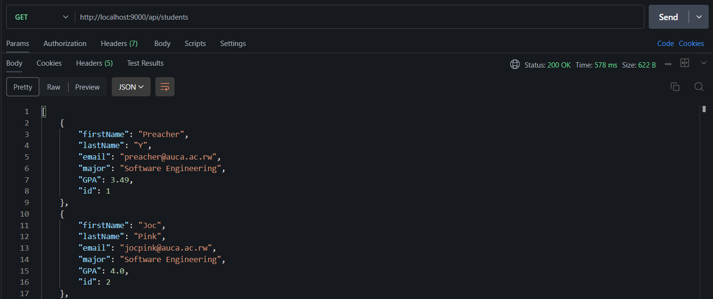
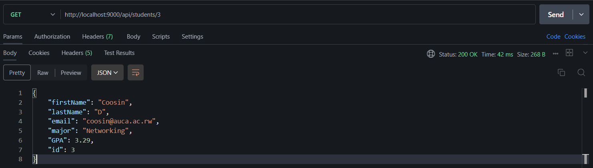
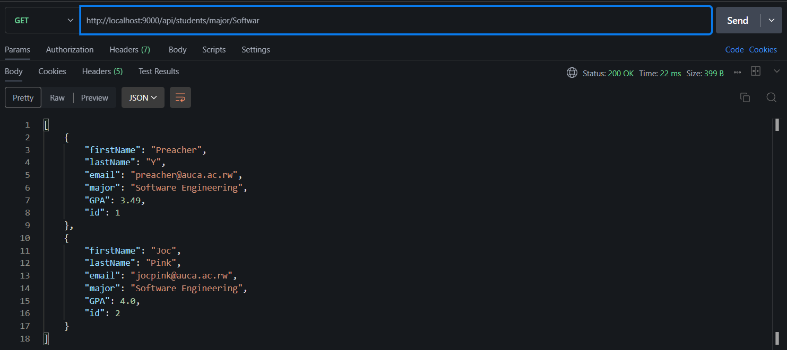
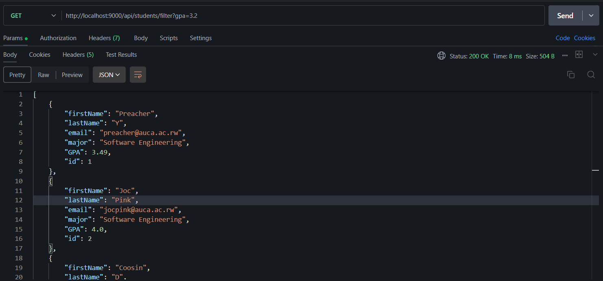
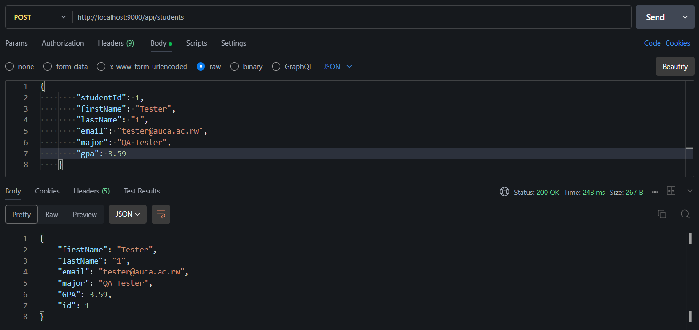
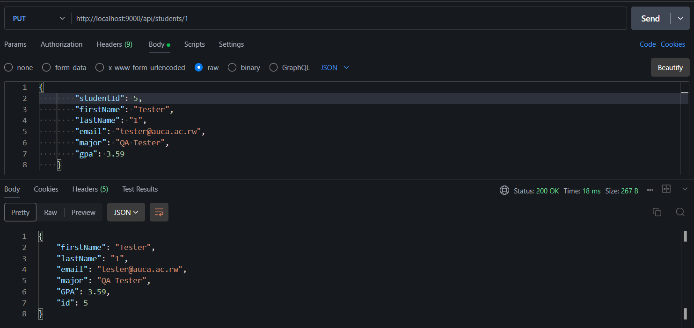

# Question 1 Student Registration API

Build a REST API for student registration and information management.

## Model and DTO

This is the Model Structure and also the Request Body for POST request :

```json
{
    "studentId": 1,
    "firstName": "Tester",
    "lastName": "1",
    "email": "tester@auca.ac.rw",
    "major": "QA Tester",
    "gpa": 3.59
}
```

## Endpoints for the Student registation (`/api/students`)

### 1. **GET  `/`** (Get all Students) : 



### 2. **GET `/{id}`** (Get specific Student):



### 3. **GET `/major/{major}`** (Get Students by major):



### 4. **GET `/filter?gpa={gpa}`** (Search Students by gpa)



### 5. **POST `/`** (Add new Student)



### 6. **PUT `/{id}`** (Update Student)



# THE END 