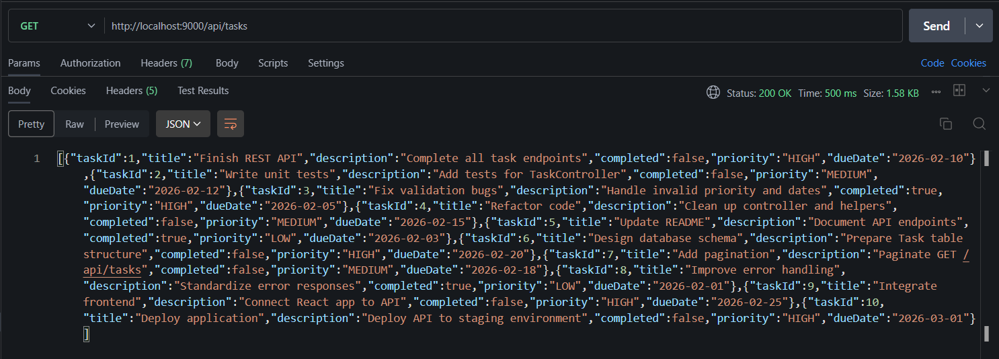
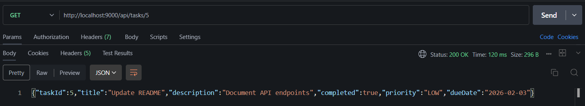
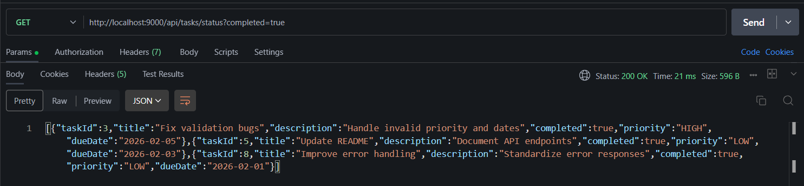
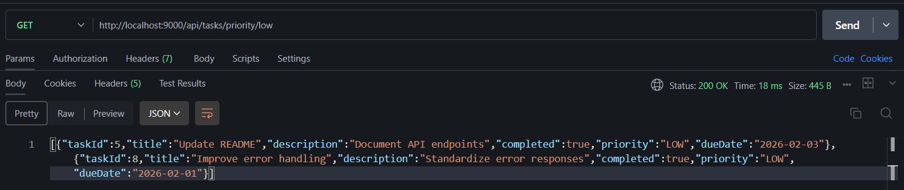
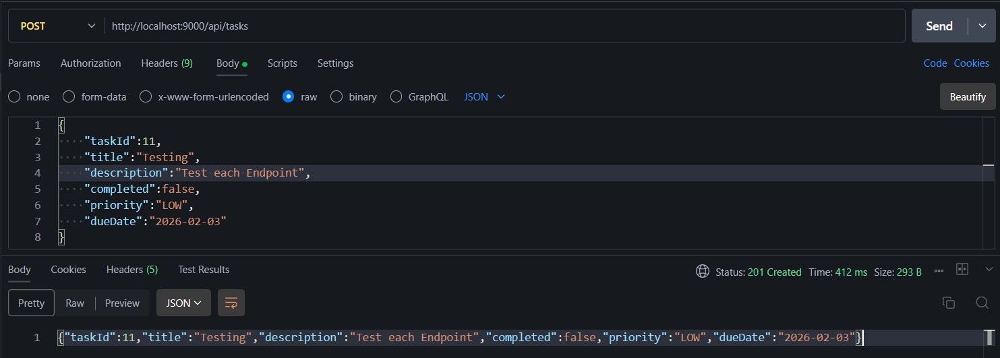
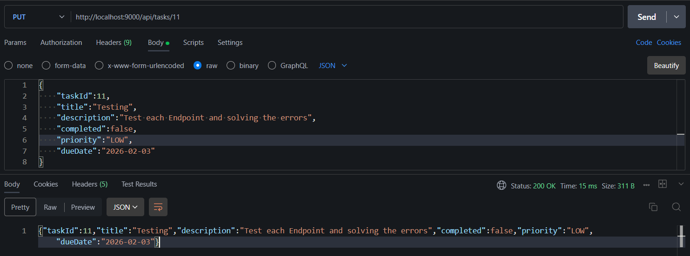
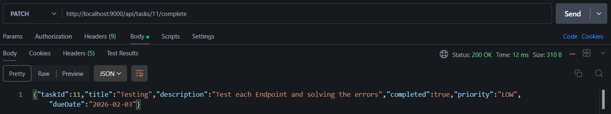

# Question 5 Task Management API

Create a simple task/to-do list API.

## Model and DTO

This is the Model Structure and also the Request Body for POST request :

```json
{
    "taskId":11,
    "title":"Testing",
    "description":"Test each Endpoint",
    "completed":false,
    "priority":"LOW",
    "dueDate":"2026-02-03"
}
```

## Endpoints for the Task Management (`/api/tasks`)

### 1. **GET  `/`** (Get all Tasks) : 



### 2. **GET `/{id}`** (Get specific task):



### 3. **GET `/status?completed={true/false}`** (Get bassed on the completeness)



### 4. **GET `/priority/{priority}`** (Get tasks by priority):



### 5. **POST `/`** (Add new task)



### 6. **PUT `/{id}`** (Update TAsk)



### 6. **PUT `/{id}/complete`** (Change Task Status)



### 7. **DELETE `/{id}`** (Remove Task)


# THE END 