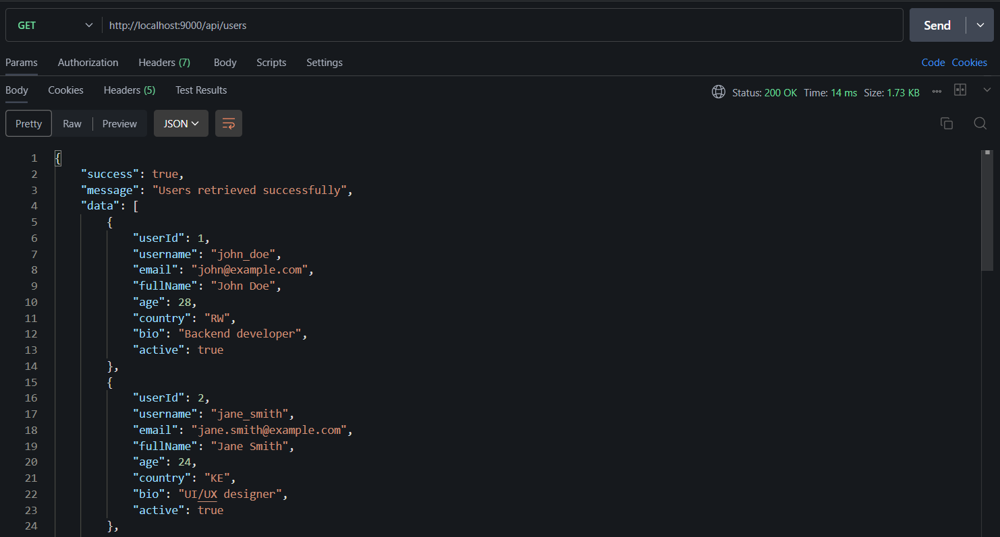
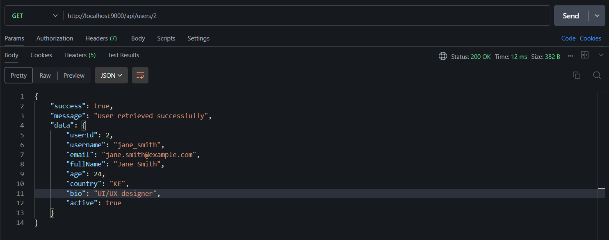
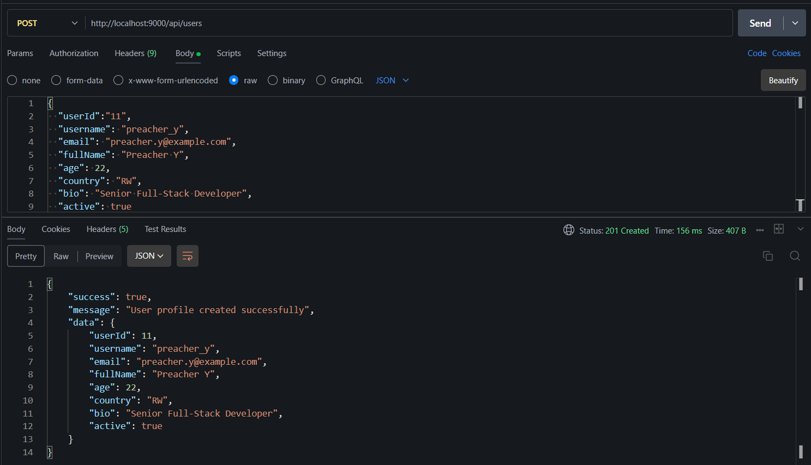
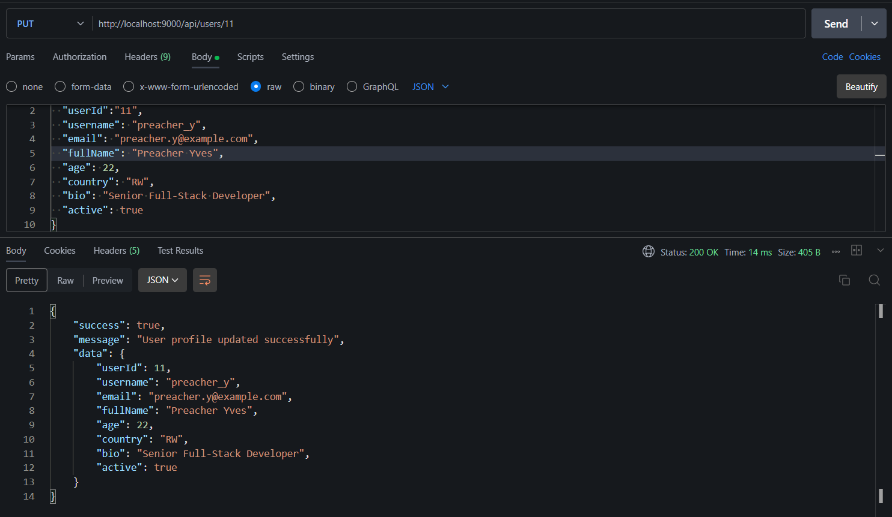
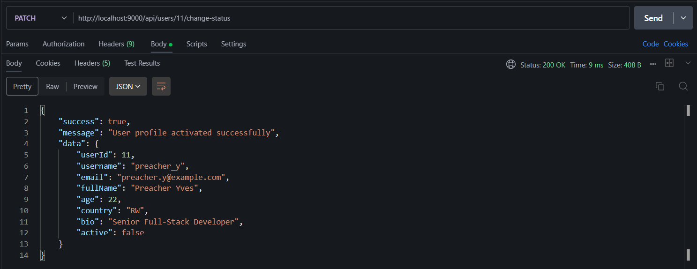
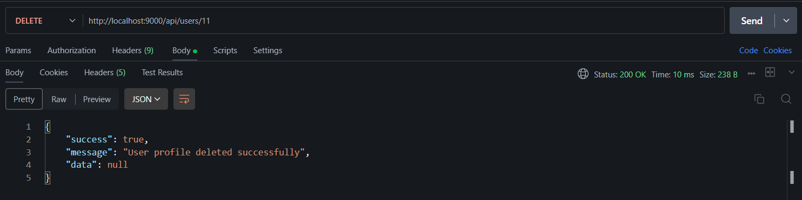

# Bonus Question User Profile API

Create a comprehensive user profile management API.

## Model and DTO

This is the Model Structure and also the Request Body for POST request :

```json
{
  "userId":"11",
  "username": "preacher_y",
  "email": "preacher.y@example.com",
  "fullName": "Preacher Y",
  "age": 22,
  "country": "RW",
  "bio": "Senior Full-Stack Developer",
  "active": true
}
```

## Endpoints for the User Profile (`/api/menu`)

### 1. **GET  `/`** (Get all users) : 



### 2. **GET `/{id}`** (Get specific user):


### 3. **GET `/search?country={country}`** (Search users by country)



### 4. **POST `/`** (Add new user)



### 5. **PUT `/{id}`** (Update user)



### 6. **PUT `/{id}/change-status`** (Toggle user's status)

*Note:* Since its a toggle, i choose to first get the previous value of the status and the do its opposite.



### 7. **DELETE `/{id}`** (Remove user)




# THE END 